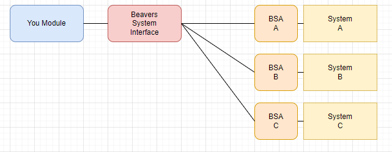

# Beaver's System Interface
This module is for developers only. It helps to write system agnostic foundry vtt modules.

Beaver's System Interface is an interface for often used system dependent functionalities.
When you write your module you just call the methods of this interface instead of writing system dependend code.
It should speed up your programming as well as gives your module the ability to work instantly for multiple Systems.



Beavers System Interface: Is an interface with some default implementations for common system dependent functionalities.

BSA-X: Beavers System Adapter for System x is an implementation of Beavers System Interface for System X.

The intention is that BSA-X implementations are kept small and simple, while complex algorithm are implemented within
BSI,

## How to work with this
### Setup
- register your module to BSI

````javascript
Hooks.on("BeaversSystemInterfaceLoaded", async function () {
    beaversSystemInterface.addModule("beavers-crafting");
});
````
- enable your module only when a BSA implementation for the current system is found

````javascript
Hooks.once("BeaversSystemInterfaceReady", async function () {

}
````
### Use BeaversSystemInterface

your module can access all "System" interface methods and properties:
[types.ts](https://github.com/AngryBeaver/beavers-system-interface/blob/main/src/types.ts)

TODO document Interface.

## TypeScript Support

When you use typescript for your module development,
you can attach the types for beaversSystemInterface so your IDE can help you with spellings and autocompletion.

package.json
````json
{
  ...
  "devDependencies": {
    "beavers-system-interface": "^1.0.1"
  }
}
````
tsconfig.json
````json
{
  "compilerOptions": {
    ...
    "types": [ "beavers-system-interface/src"]
  }
}
````
## How to write BSA-X implementations
### Setup
- register your BSA-X to BSI
````javascript
Hooks.on("BeaversSystemInterfaceLoaded", async function(){
  beaversSystemInterface.register(new Dnd5e());
});
````
### Implement the SystemApi
create A class that implements the SystemApi
````typescript
export class Dnd5e implements SystemApi {
  
}
````
and then implement it ;-)
Set your version to the major version of the SystemApi you implement.

TODO document Interface.

## Why this module

- ### Request for another system
  I got requested to make my module available for another system.
  I did not know this system, so I searched for a way to allow others to write the system dependent parts for their
  system they know
  without breaking my module.
- ### Discussion about "open gaming Licence"
  With the discussion of wizards of the coast "open gaming licence", I do no longer want to write a module explicitly
  for dnd
  especially if I can get sued for any or no reasons. So I decided to rewrite my module system agnostic. Then I only
  need to write an implementation of BSI for dnd5e, this implementation does not enable anyone todo anything it just
  connects an interface to its implementation.


